# 虚幻4蓝图助手使用说明

论坛页面: https://forums.unrealengine.com/unreal-engine/marketplace/1435240-node-graph-assistant  
商城页面: https://www.unrealengine.com/marketplace/node-graph-assistant  

1.左键自由连接。  
*可设置为只连接一次
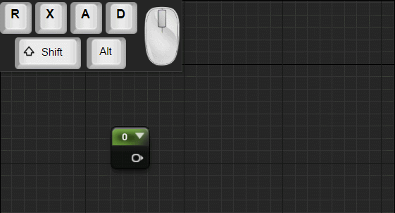  

2.Shift键自由连接。  
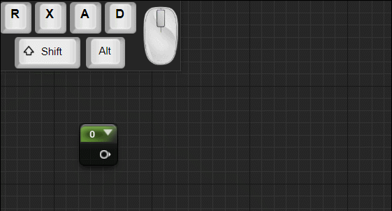  

3.复制连线，按住<kbd>Shift</kbd>键点击或拖动引脚来复制连线。  
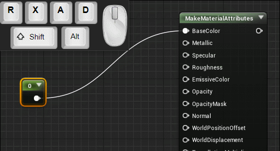  

4.排列节点： 热键<kbd>Alt</kbd>+<kbd>R</kbd>，适用于小数量节点的排列。    
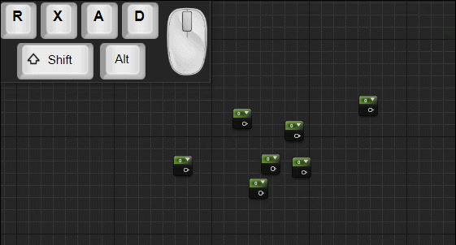  

5.一键连接节点: 按下<kbd>Alt</kbd>+<kbd>C</kbd> 连接当前选中节点所有可连的引脚。  
  

6.溶解节点:  <kbd>Alt</kbd>+<kbd>X</kbd>
*按住<kbd>Shift</kbd>会保留被溶解的节点。   
*可设置将溶解的节点复制到剪贴板。  
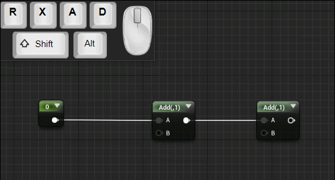  

7.在线创建节点。  
*对快捷键创建的节点也起作用。  
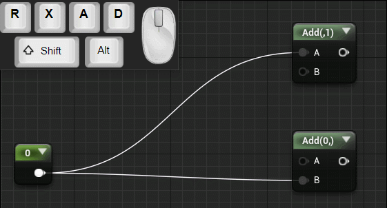  
  

8.连线高亮：  
*按住<kbd>Shift</kbd>键可高亮多条连线。  
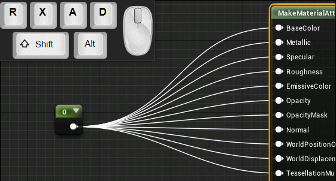  

9.剪断连线：按住<kbd>Alt</kbd>鼠标中键滑动。    
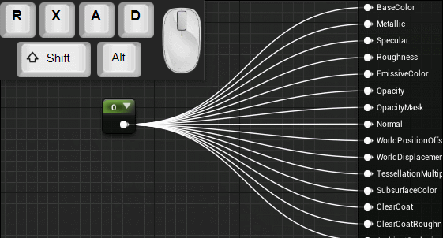  

10.选择直连节点: 中键双击选择连接着的节点，如果双击位置在节点左边则选择输入连接的节点，反之选择输出连接的节点。    
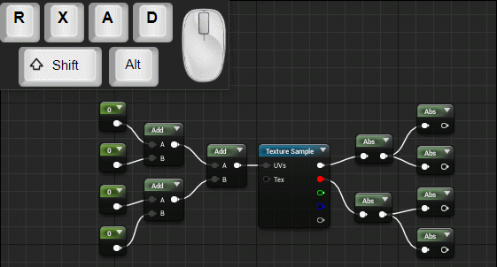  

11.辅助连接: 
(按住<kbd>Shift</kbd> 并点击拖拽可批量连接。  
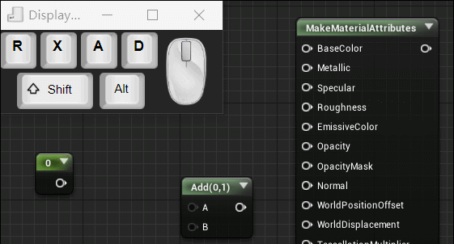  
 
12.自动连接：拖动节点时，引脚自动吸附周围的引脚，放开鼠标确认，按住alt键会暂停该功能。   
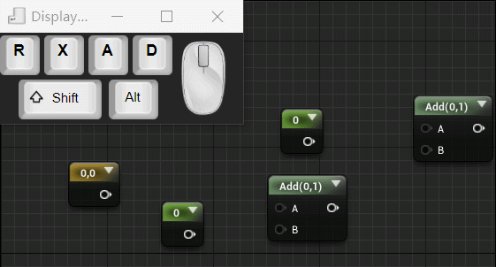  

13.连线样式：点击工具栏图标切换连线样式。  
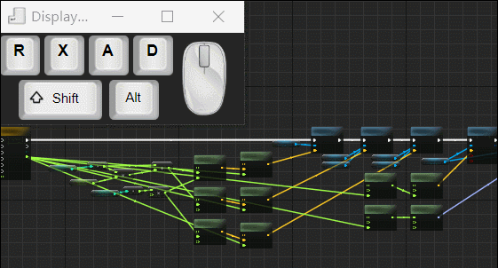  

14.甩节点: 快速挥动节.  
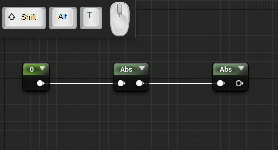  

15.复制节点和输入连线：默认键位"alt+V"  
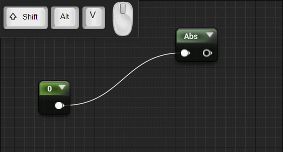  

16.插入节点:  
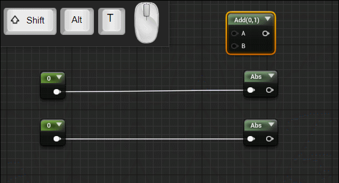  

17.交换连线：<kbd>Alt</kbd>+<kbd>T</kbd>.   
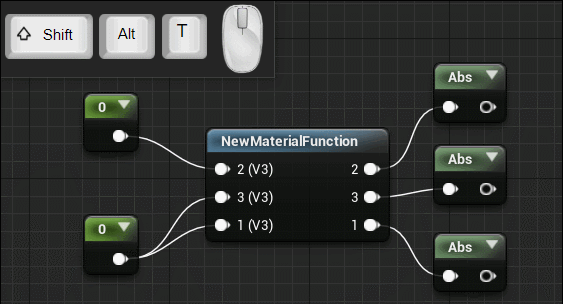  

到设置界面调整更多设置。  

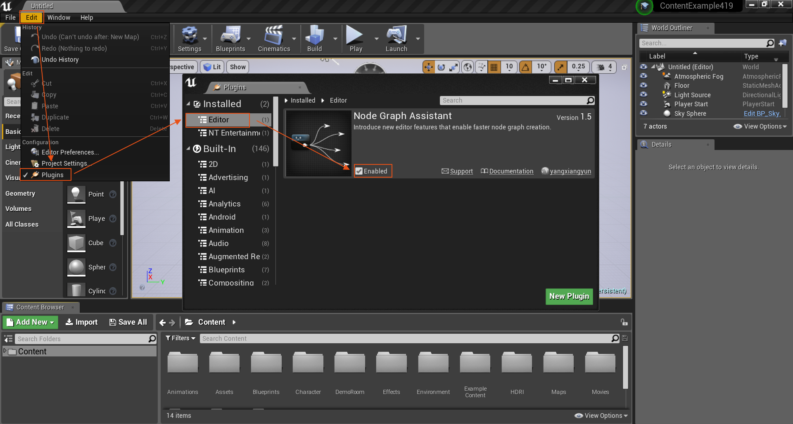  
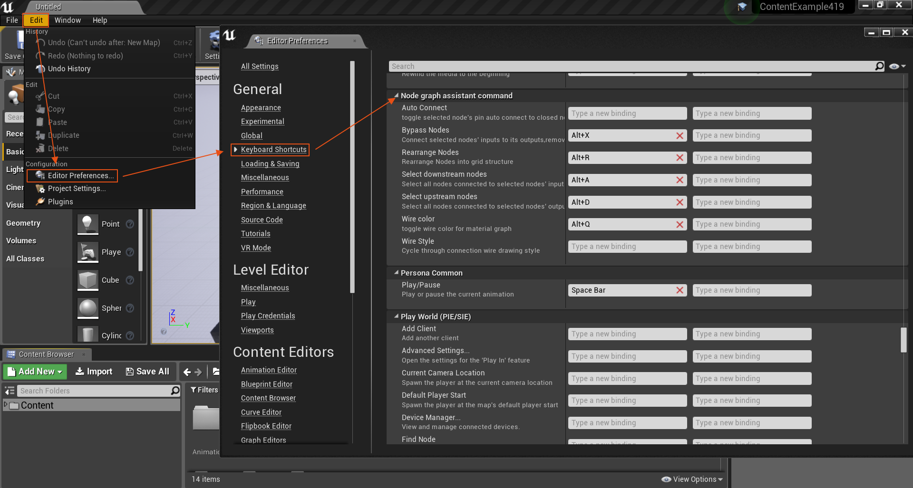  
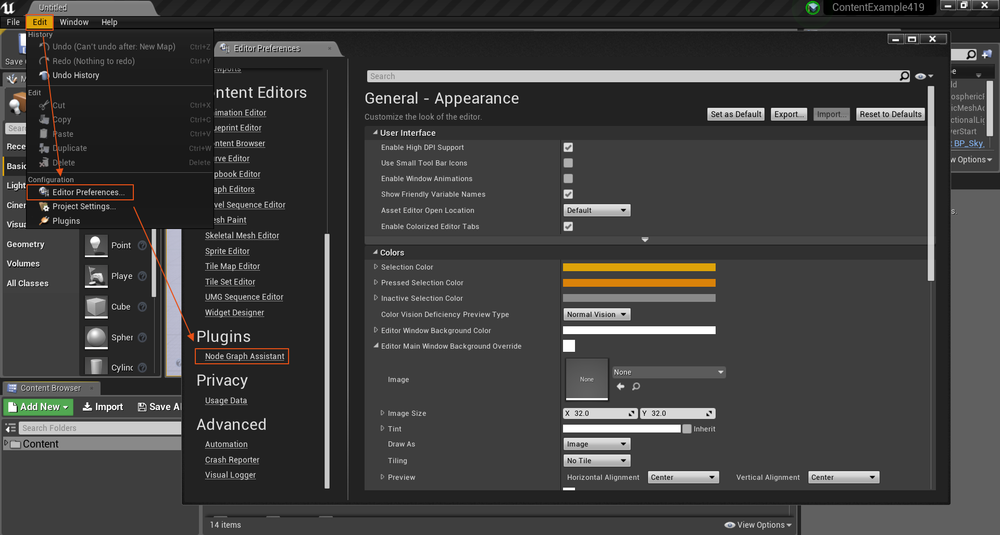  

 
