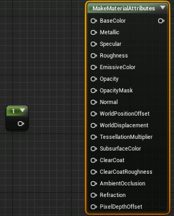

# UE4-Multi-Dropping-Tool
Some functionalities I put together for speeding up node graph creation,also for some general drag-drop actions.  

Multi dropping,when "shift" is pressing will perform a drop action but keep drag action alive,each left click will perform a drop:  
  

Drag and pan:  
  

Trace:  
  

All these features work for blueprint editor too:  
  

It also applys to general drag and drop actions:  

