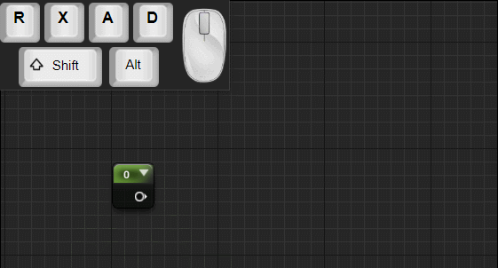
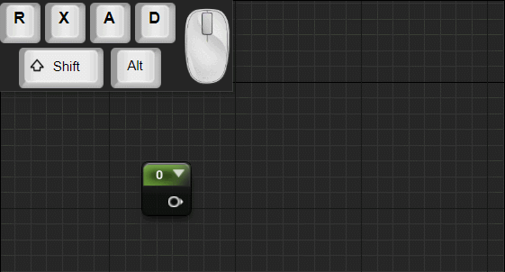
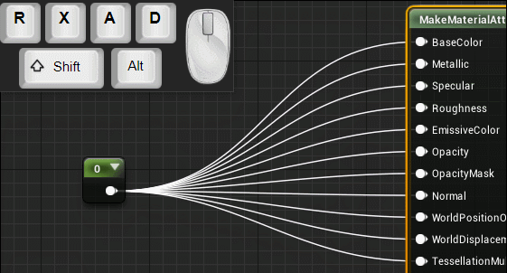
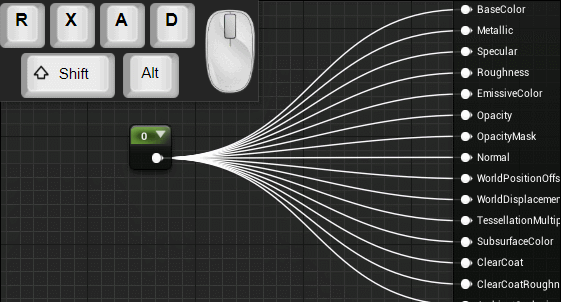

# UE4-Node-Graph-Assistant User Guide

When dragging a wire, pan just like normal, right click on pin to multi-connect,right click on panel to cancel.  
  

Click on pin to start free panning,zooming and multi-connecting.  
  

When dragging a wire, hold down shift to  start free panning,zooming and multi-connecting.  
  

Shift click on pin to duplicate wire.  
  

Left click to highlight wire, hold down shift to highlight multiple wires,middle mouse double click on pin to highlight all connected wires.  
  

Middle mouse double click on node to selecte all connected nodes.  
Depend on left or right area of the node clicked on,will select all children or all parents.  

Hold down alt and drag on empty space will break all connection wires along its way.  

 
