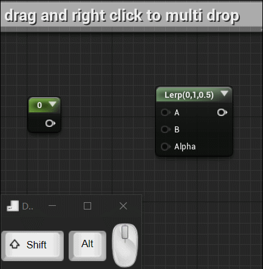
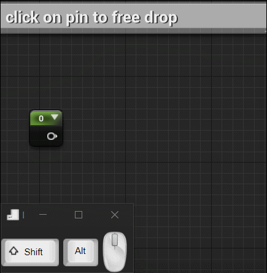
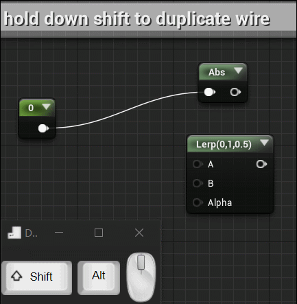
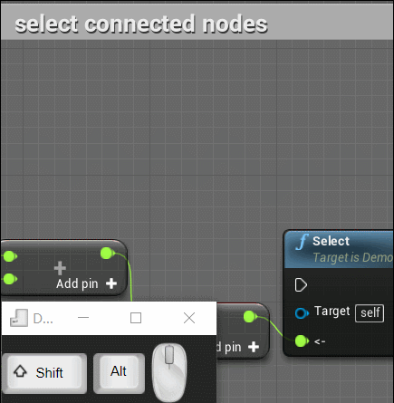
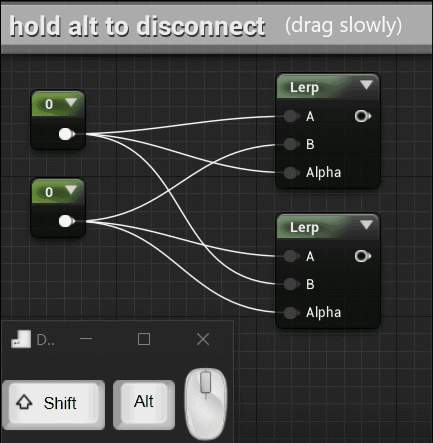

# UE4-Node-Graph-Assistant User Guide

Right click on pins to connect multiple nodes while dragging a connection wire.  
  

Click on pin to start free panning,zooming and dropping.  
(hold down shift will also enter this mode)  
  

Shift click on connected node pin to duplicate connection wire.  
  

(1.3 up comming feature)Double click on pin to highlight all connected,single click to highlight single wire,shift toggle highlight.    
 (for function nodes,slowly double click to avoid openning the node)  
  

 (1.3 up comming feature)Double click on node to selecte all connected nodes.  
 depend on left or right area of the node clicked,will select all children or all parents.  
 (for function nodes,move mouse a little bit between two click to avoid openning the node)  

Left click and drag on empty space while holding down alt will break all connection wires along its way.  
(note that this is a experimental feature,if you are dragging too fast,some connection wires may still stay connected).  

 
