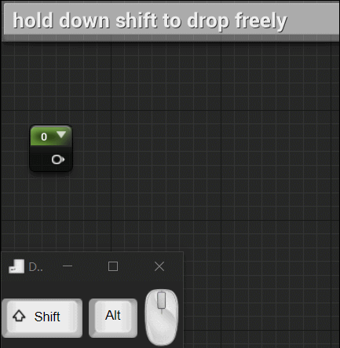

# UE4-Node-Graph-Assistant User Guide

Right click on pins to connect multiple nodes while dragging a connection wire.  
  

Right click and drag while dragging a connection wire will pan the node graph.  
  

Click on pin to start free panning,zooming and dropping(without using keyboard).  
  

Hold down shift while dragging a connection to start free panning,zooming and dropping.   
  

Shift click on connected node pin will duplicate connection wire.  
  

 Left click on connection wire will highlight it,click on empty space to remove highlight.  

Left click and drag on empty space while holding down alt will break all connection wires along its way(note that this is a experimental feature,if you are dragging too fast,some connection wires may still stay connected).  

QnA:  
Does it support blueprint or other type of node graph?   
Yes,it supports blueprint,also generally every kind of node graphs like animation blueprint or behavior tree graph.I mostly test on material graph and blueprint graph.  

Will it support other platform and engine version?  
I'll try to support more platform and engine version in the future if there is no technical difficulty.  

Tips:  
 
