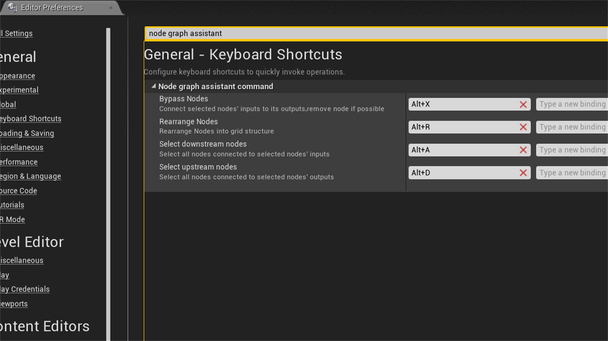
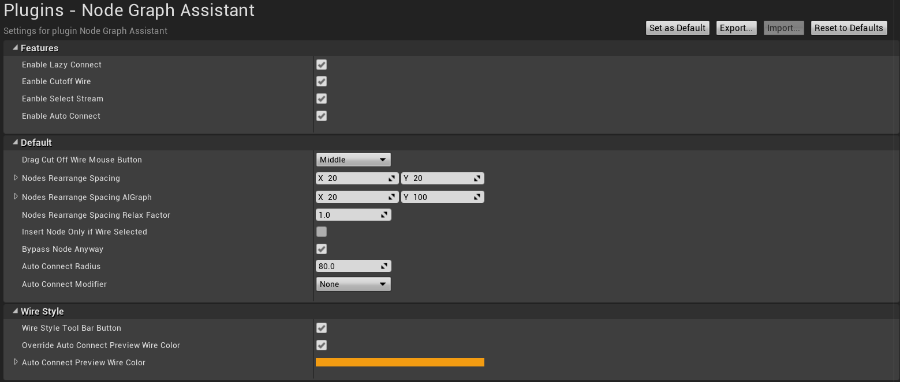

# UE4-Node-Graph-Assistant User Guide

support page: https://forums.unrealengine.com/unreal-engine/marketplace/1435240-node-graph-assistant  
Marketplace page: https://www.unrealengine.com/marketplace/node-graph-assistant  

1.Right click multi-connect: When dragging a wire, pan just like normal, right click on pin to multi-connect,right click on panel to cancel.  
  

2.Left click multi-connect: Click on pin to start free panning,zooming and multi-connecting.  
  

3.Shift click multi-connect: When dragging a wire, hold down shift to  start free panning,zooming and multi-connecting.  
  

4.Dupli-wire: Shift click on pin to duplicate wire.  
  

5.Rearrange nodes: Press alt + r to rearrange nodes,most suitable for small block of nodes.   
  

6.Bypass node: Press alt + x will remove selected nodes on wire.  
  

7.Insert node: Right click on wire to insert node on wire.  

8.Highlight wire: Left click to highlight wire, hold down shift to highlight multiple wires,middle mouse double click on pin to highlight all connected wires.  
  

9. Cutoff wires: Hold down alt and drag on empty space will break all wires along its way.  
  

10.Select linked node: Middle mouse double click on node to selecte all connected nodes.  
Depend on left or right area of the node clicked on,will select all children or all parents.  
Or use hot key alt+a, or alt +d.  
  

11.Lazy connect: Wire will auto align to closest connectible pin of the current hovered node.  
when click and drag while hold down shit will connect all node pins under cursor.  
  
 
12.Auto connec: When moving a node,its pins will align to surrounding connectible pins, releasing mouse will commit connections.  
hold down alt will suppress auto connect.  
or click tool bar icon to disable.  
auto connect only apply to node under mouse,and will only make connection between unconnected pins of two unconnected nodes.  
  

13.Wire style: press tool bar button to cycle through wire style.  
  

Go to editor preference to see more settings.  

  
  

 
